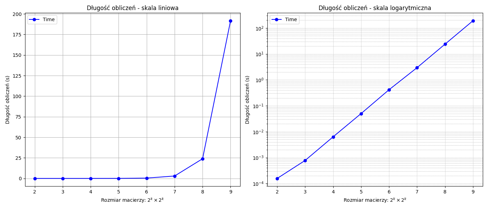
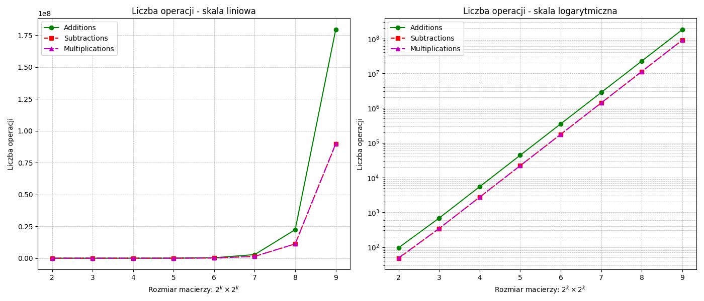

# Mnożenie macierzy algorytmem Bineta i Strassena
#### Jakub Płowiec, Filip Dziurdzia

## Zadanie
Dla macierzy o rozmiarze mniejszym lub równym $2^l \times 2^l$ algorytm rekurencyjny Binéta. Dla macierzy o rozmiarze większym od $2^l × 2^l$ algorytm rekurencyjny Strassena.

## Wstęp teoretyczny

## 1. Wprowadzenie  

Najbardziej intuicyjną metodą mnożenia jest **klasyczne mnożenie macierzy**, które ma złożoność czasową **O(n³)**. W celu zwiększenia efektywności opracowano różne optymalizacje, takie jak:  

- **Metoda Bineta**, która opiera się na rekurencyjnym dzieleniu macierzy na mniejsze bloki i stosowaniu klasycznego mnożenia dla najmniejszych podmacierzy.  
- **Metoda Strassena**, która wykorzystuje sprytne obliczenia rekurencyjne, zmniejszając liczbę operacji mnożenia kosztem dodatkowych operacji dodawania i odejmowania.  

Obie te metody zmniejszają liczbę operacji mnożenia, co prowadzi do przyspieszenia obliczeń w porównaniu do klasycznej metody.

## 2. Klasyczne mnożenie macierzy  

Niech dane będą dwie macierze kwadratowe:

$$
A = [a_{ij}] \quad \text{oraz} \quad B = [b_{ij}]
$$

o wymiarach $n \times n$. Klasyczne mnożenie macierzy definiujemy jako:

$$
C = A \cdot B, \quad \text{gdzie} \quad c_{ij} = \sum_{k=1}^{n} a_{ik} \cdot b_{kj}
$$

Dla każdego elementu $c_{ij}$ wykonujemy $n$ operacji mnożenia i dodawania, co prowadzi do całkowitej liczby operacji rzędu **O(n³)**.

## 3. Metoda Bineta – mnożenie adaptacyjne  

### 3.1 Idea metody  

Metoda Bineta polega na rekurencyjnym podziale macierzy na bloki i wykonywaniu mnożenia na mniejszych podmacierzach.

### 3.2 Algorytm  

1. **Podział macierzy na podmacierze**  
   Dzielimy macierze na cztery mniejsze bloki:

$$
A =
\begin{bmatrix}
A_{11} & A_{12} \\
A_{21} & A_{22}
\end{bmatrix}, \quad
B =
\begin{bmatrix}
B_{11} & B_{12} \\
B_{21} & B_{22}
\end{bmatrix}
$$

2. **Rekurencyjne mnożenie bloków**  
   Obliczamy wyniki dla podmacierzy:

$$
C_{11} = A_{11} B_{11} + A_{12} B_{21}
$$
$$
C_{12} = A_{11} B_{12} + A_{12} B_{22}
$$
$$
C_{21} = A_{21} B_{11} + A_{22} B_{21}
$$
$$
C_{22} = A_{21} B_{12} + A_{22} B_{22}
$$

3. **Scalanie wyników**  
   Łączymy bloki w macierz wynikową $C$.

### 3.3 Złożoność obliczeniowa  

Niestety metoda Bineta działa ze złożonością **O(n³)**, jednakże wykonywanych jest mniej operacji niż przy klasycznym mnożeniu.

## 4. Metoda Strassena  

### 4.1 Idea metody  

Metoda Strassena, opracowana przez Volkera Strassena w 1969 roku, redukuje liczbę operacji mnożenia, zamieniając część z nich na operacje dodawania i odejmowania. Kluczowa idea tej metody polega na inteligentnym wykorzystaniu tożsamości macierzowych w celu zmniejszenia liczby mnożeń blokowych z **8 do 7**.  

Dzięki temu, zamiast złożoności **$O(n^3)$**, uzyskujemy złożoność **$O(n^{\log_2 7}) \approx O(n^{2.81})$**, co jest znaczną poprawą dla dużych macierzy.

### 4.2 Algorytm  

Podobnie jak w metodzie Bineta, dzielimy macierze $A$ i $B$ na cztery bloki. Następnie definiujemy siedem pośrednich iloczynów macierzowych:

$$
M_1 = (A_{11} + A_{22}) \cdot (B_{11} + B_{22})
$$

$$
M_2 = (A_{21} + A_{22}) \cdot B_{11}
$$

$$
M_3 = A_{11} \cdot (B_{12} - B_{22})
$$

$$
M_4 = A_{22} \cdot (B_{21} - B_{11})
$$

$$
M_5 = (A_{11} + A_{12}) \cdot B_{22}
$$

$$
M_6 = (A_{21} - A_{11}) \cdot (B_{11} + B_{12})
$$

$$
M_7 = (A_{12} - A_{22}) \cdot (B_{21} + B_{22})
$$

Na ich podstawie obliczamy elementy wynikowej macierzy $C$:

$$
C_{11} = M_1 + M_4 - M_5 + M_7
$$

$$
C_{12} = M_3 + M_5
$$

$$
C_{21} = M_2 + M_4
$$

$$
C_{22} = M_1 - M_2 + M_3 + M_6
$$

### 4.3 Złożoność obliczeniowa  

Metoda Strassena redukuje liczbę mnożeń, ale wprowadza dodatkowe operacje dodawania i odejmowania. Jej złożoność wynosi:

$$
O(n^{\log_2 7}) \approx O(n^{2.81})
$$

co daje znaczną poprawę dla dużych macierzy.

## Rozwiązanie
Implementację obu algorytmów, funkcji je scalającej oraz generowanie wykresów wykonaliśmy w języku **Python**.

### 1. Pseudokod 
**Funkcja: `matrix_multiplication(A, B, l)`**
- **Dane wejściowe:**  
  - `A`, `B`: Kwadratowe macierze o rozmiarze $n \times n$  
  - `l`: Próg przełączania na metodę Strassena  
- **Wynik:**  
  - Macierz `C`, będąca wynikiem iloczynu `A * B`

**Algorytm:**
1. **Warunek bazowy:**  
   - Jeśli `n <= l`, oblicz `C = strassen_multiplication(A, B)` i zwróć wynik.

2. **Podział macierzy:**  
   - Podziel `A` na cztery podmacierze: `A_11, A_12, A_21, A_22`  
   - Podziel `B` na cztery podmacierze: `B_11, B_12, B_21, B_22`  

3. **Rekurencyjne obliczanie wynikowych podmacierzy:**  
   Oblicz podmacierze `C` według wzoru:
   - `C_11 = matrix_multiplication(A_11, B_11, l) + matrix_multiplication(A_12, B_21, l)`
   - `C_12 = matrix_multiplication(A_11, B_12, l) + matrix_multiplication(A_12, B_22, l)`
   - `C_21 = matrix_multiplication(A_21, B_11, l) + matrix_multiplication(A_22, B_21, l)`
   - `C_22 = matrix_multiplication(A_21, B_12, l) + matrix_multiplication(A_22, B_22, l)`

4. **Scalanie wyników:**  
   - Połącz podmacierze `C_11, C_12, C_21, C_22` w pełną macierz `C` za pomocą `merge_matrices()`.

5. **Zwróć wynikową macierz `C`**  

**Funkcja: `strassen_multiplication(A, B)`**
- **Dane wejściowe:**  
  - `A`, `B`: Kwadratowe macierze o rozmiarze $n \times n$
- **Wynik:**  
  - Macierz `C`, będąca wynikiem iloczynu `A * B`  

**Algorytm:**
1. **Warunek bazowy:**  
   - Jeśli `n == 1`, wykonaj zwykłe mnożenie skalarne `C = A * B` i zwróć wynik.

2. **Podział macierzy:**  
   - Podziel `A` na cztery podmacierze: `A_11, A_12, A_21, A_22`  
   - Podziel `B` na cztery podmacierze: `B_11, B_12, B_21, B_22`  

3. **Obliczenie siedmiu macierzy pomocniczych `M_i`:**  
   - `M1 = strassen_multiplication(A_11 + A_22, B_11 + B_22)`  
   - `M2 = strassen_multiplication(A_21 + A_22, B_11)`  
   - `M3 = strassen_multiplication(A_11, B_12 - B_22)`  
   - `M4 = strassen_multiplication(A_22, B_21 - B_11)`  
   - `M5 = strassen_multiplication(A_11 + A_12, B_22)`  
   - `M6 = strassen_multiplication(A_21 - A_11, B_11 + B_12)`  
   - `M7 = strassen_multiplication(A_12 - A_22, B_21 + B_22)`

4. **Obliczenie podmacierzy wynikowej macierzy `C`:**  
   - `C_11 = M1 + M4 - M5 + M7`  
   - `C_12 = M3 + M5`  
   - `C_21 = M2 + M4`  
   - `C_22 = M1 - M2 + M3 + M6`  

5. **Scalanie wyników:**  
   - Połącz `C_11, C_12, C_21, C_22` w macierz `C` za pomocą `merge_matrices()`.  

6. **Zwróć wynikową macierz `C`**  

### 2. Wyniki
Obliczenia wykonaliśmy dla $k \in [2, 9]$ i otrzymane rezultaty przedstawiliśmy na wykresach poniżej. Każdy eksperyment został wykonany dla `l=4`.

Następnie przeprowadziliśmy doświadczenia ze zmienną wartością $l \in [2, 5]$

Możemy zauważyć niewielką różnicę w czasach wywołania dla różnych `l` - im mniejsza jego wartość tym obliczenia były nieznacznie szybsze. Wynika to z faktu, że mnożenie algorytmem **Strassena** jest szybsze od mnożenia metodą **Bineta**, więc im szybciej zaczniemy z niej korzystać w obliczeniach tym szybciej otrzymamy całościowe wyniki.