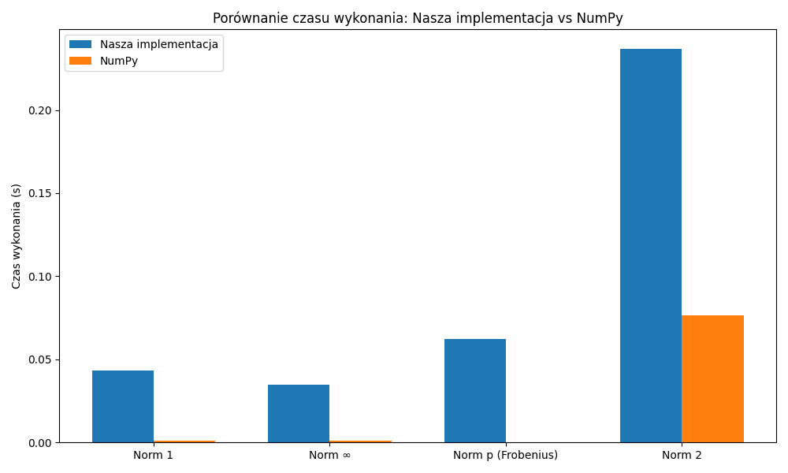

# Obliczanie norm i współczynników uwarunkowania macierzy
#### Jakub Płowiec, Filip Dziurdzia

## Zadanie
W wybranym języku programowania (Python) napisać program, który:
- Oblicza normę macierzową $||M||_1$
- Oblicza współczynnik uwarunkowania macierzowy $||M||_1$
- Oblicza normę macierzową $||M||_2$
- Oblicza współczynnik uwarunkowania macierzowy $||M||_2$
- Oblicza normę macierzową $||M||_p$
- Oblicza współczynnik uwarunkowania macierzowy $||M||_p$
- Oblicza normę macierzową $||M||_{\infin}$
- Oblicza współczynnik uwarunkowania macierzowy $||M||_{\infin}$

## Wstęp teoretyczny

### 1. Normy macierzowe

Norma macierzowa to funkcja przypisująca każdej macierzy nieujemną liczbę rzeczywistą, która opisuje jej "wielkość". Wyróżniamy m.in.:

- **Norma kolumnowa ($\bold{||M||_1}$):** maksymalna suma bezwzględnych wartości elementów w kolumnie.
- **Norma spektralna ($\bold{||M||_2}$):** największa wartość singularna macierzy (czyli pierwiastek z największej wartości własnej $M^TM$).
- **Norma Frobeniusa ($\bold{||M||_F}$):** pierwiastek z sumy kwadratów wszystkich elementów macierzy.
- **Norma wierszowa ($\bold{||M||_\infin}$):** maksymalna suma bezwzględnych wartości elementów w wierszu.

### 2. Współczynnik uwarunkowania

Współczynnik uwarunkowania macierzy względem danej normy to liczba:

$$
\kappa_p = ||M||_p \cdot ||M^{-1}||_p
$$

Im wyższy współczynnik, tym bardziej układ równań oparty na tej macierzy jest **wrażliwy na zakłócenia** (czyli jest źle uwarunkowany). Wartości bliskie 1 oznaczają dobrze uwarunkowaną macierz.

---

## Rozwiązanie

Implementacja została wykonana w języku **Python**. Biblioteka `numpy` została wykorzystana do obliczenia wartości własnych macierzy oraz jako benchmark.

### Rozwiązanie

#### **Funkcja:** `norm_1(M: array) -> float`

**Dane wejściowe:**  
- `M`: macierz

**Wyniki:**  
- wartość normy macierzowej $||M||_1$

**Implementacja:**
```python
def norm_1(M):
    return max(sum(abs(M[i][j]) for i in range(len(M))) for j in range(len(M[0])))
```

#### **Funkcja:** `norm_2(M: array) -> float`

**Dane wejściowe:**  
- `M`: macierz

**Wyniki:**  
- wartość normy macierzowej $||M||_2$

**Implementacja:**
```python
def norm_2(M):
    MtM = np.dot(np.transpose(M), M)
    eigenvalues = np.linalg.eigvals(MtM)
    max_eigenvalue = max(abs(eig) for eig in eigenvalues)
    return max_eigenvalue ** 0.5
```

#### **Funkcja:** `norm_frobenius(M: array) -> float`

**Dane wejściowe:**  
- `M`: macierz

**Wyniki:**  
- wartość normy macierzowej Frobeniusa $||M||_F$

**Implementacja:**
```python
def norm_frobenius(M):
    return (sum(M[i][j]**2 for i in range(len(M)) for j in range(len(M[0]))))**0.5
```

#### **Funkcja:** `norm_inf(M: array) -> float`

**Dane wejściowe:**  
- `M`: macierz

**Wyniki:**  
- wartość normy macierzowej $||M||_\infin$

**Implementacja:**
```python
def norm_inf(M):
    return max(sum(abs(M[i][j]) for j in range(len(M[0]))) for i in range(len(M)))
```

#### **Funkcja:** `test_implementation(matrix_size: int) -> None | AssertionException`

**Dane wejściowe:**  
- `matrix_size`: rozmiar macierzy kwadratowej która ma zostać wygenerowana
- `epsilon`: dozwolony błąd podczas porównania wyników z biblioteką `numpy`

**Wyniki:**  
- Zapewnienie zgodnych wyników pomiędzy implementacjami lub błąd

#### **Funkcja:** `benchmark_and_plot(matrix_size: int) -> None`

**Dane wejściowe:**  
- `matrix_size`: rozmiar macierzy kwadratowej która ma zostać wygenerowana

**Wyniki:**  
- Wykresy porównujące naszą implementację z implementacjami w bibliotece `numpy`

---

### Wyniki

Wygenerowaliśmy macierze kwadratowe o rozmiarze `1000` i korzystając z funkcji `benchmark_and_plot` porównaliśmy czasy wykonań naszych implementacji oraz implementacji w bibliotece `numpy` oraz przedstawiliśmy te różnice na wykresie:

