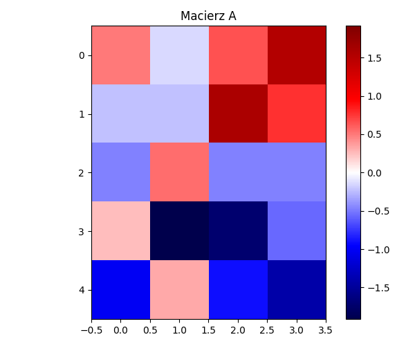
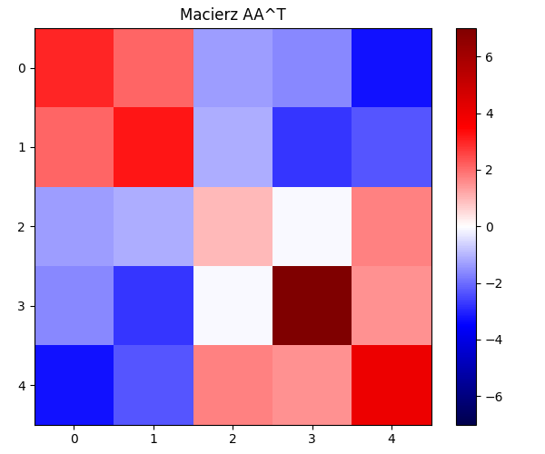
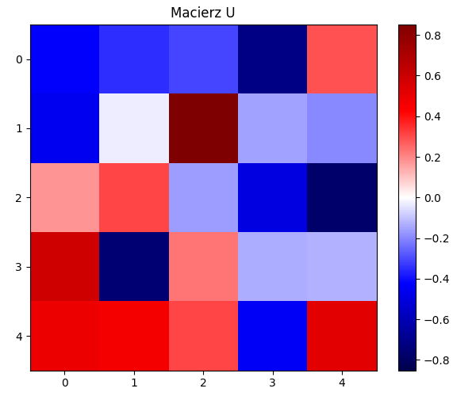
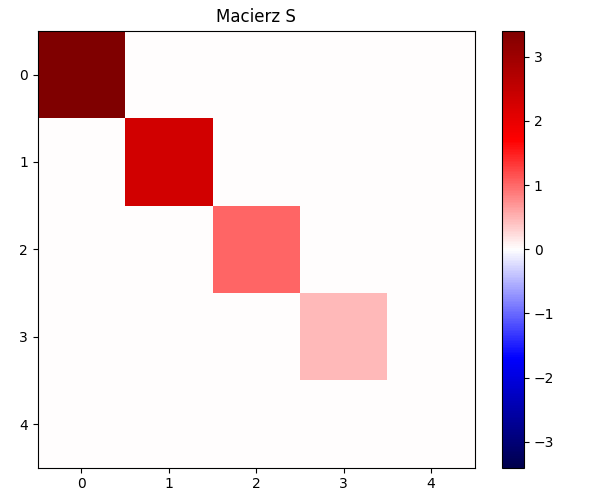
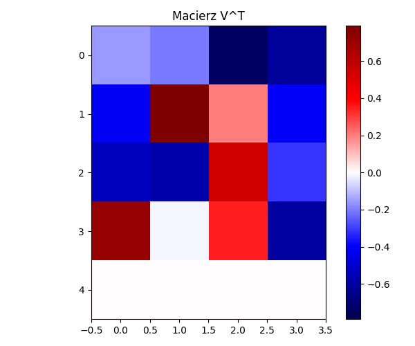
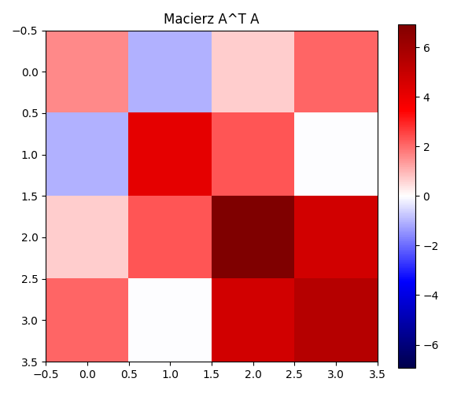
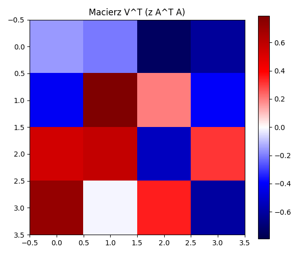
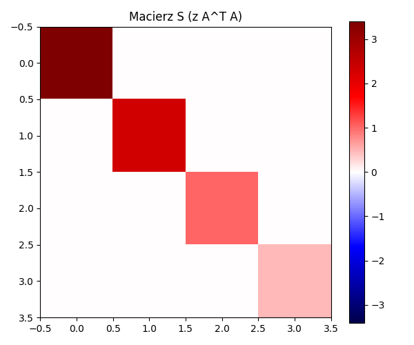
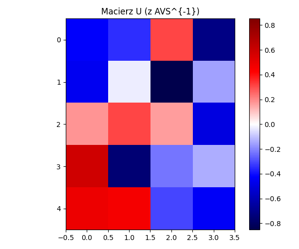

# Dekompozycja SVD Macierzy — Raport

Filip Dziurdzia, Jakub Płowiec

## 1. Wstęp

Celem zadania było przeprowadzenie dekompozycji SVD (Singular Value Decomposition) macierzy prostokątnej A o rozmiarach $(n \times m)$.
Proces ten polega na rozbiciu macierzy A na trzy składniki:

$$
A = U S V^T
$$

gdzie:
- $U$ — macierz ortogonalna (wiersze to wektory własne $AA^T$),
- $S$ — macierz diagonalna (singular values — pierwiastki z wartości własnych),
- $V^T$ — macierz transponowana macierzy ortogonalnej $V$ (wiersze to wektory własne $A^TA$).

## 2. Wybrane narzędzia

- **Język programowania:** Python 3.10
- **Biblioteki:**
  - `numpy` — operacje na macierzach, wartości i wektory własne
  - `matplotlib` — wizualizacja macierzy

## 3. Struktura kodu

Kod został uruchomiony dla $n = 5, m = 4$ i składa się z następujących kroków:

### 3.1 Wygenerowanie macierzy A

Generujemy losowo macierz $A$ o rozmiarze $n \times m$.

### 3.2 Dekompozycja przez $AA^T$

W pierwszej metodzie rozpoczynamy od obliczenia macierzy $AA^T$, następnie znajdujemy wartości własne oraz wektory własne tej macierzy, które zostaną wykorzystane do wyliczenia $U$ oraz $S$. Kolejnym krokiem jest obliczenie $V$ ze wzoru:

$$
V = A^T U S^{-1}
$$

### 3.2.1 Obliczenie $AA^T$

Pierwszym krokiem w tej metodzie jest obliczenie macierzy $AA^T$. Produkt $AA^T$ jest macierzą kwadratową, o wymiarach $n \times n$. Obliczenie tej macierzy jest kluczowe, ponieważ w kolejnych krokach będziemy wykorzystywać jej wartości i wektory własne do wyznaczenia macierzy $U$ i $S$.

### 3.2.2 Wyznaczenie macierzy $U$ i $S$
Kolejnym krokiem jest obliczenie wartości i wektorów własnych macierzy $AA^T$. Wartości własne odpowiadają pierwiastkom kwadratowym z wartości osobliwych macierzy $A$. Wektory własne stanowią kolumny macierzy $U$, a wartości własne są umieszczane na przekątnej macierzy diagonalnej $S$.

- $U$ — wektory własne macierzy $AA^T$
- $S$ — pierwiastki wartości własnych (na przekątnej)

### 3.2.3 Wyznaczenie macierzy $V$

Po obliczeniu macierzy $U$ oraz $S$, możemy wyznaczyć macierz $V$ za pomocą wzoru:

$$
V = A^TUS^{-1}
$$

W praktyce oznacza to obliczenie odwrotności macierzy diagonalnej $S$, a następnie obliczenie macierzy $V$. Wartości te są użyteczne w dalszych obliczeniach, ponieważ macierz $V$ zawiera wektory własne $A^TA$.

### 3.3 Dekompozycja przez $A^TA$

W drugiej metodzie, obliczamy macierz $A^TA$ i na jej podstawie wyznaczamy wartości własne i wektory własne, które zostaną wykorzystane do wyznaczenia $V$ oraz $S$. Kolejnym krokiem jest obliczenie 
$U$ ze wzoru:

$$
U = A V S^{-1}
$$

### 3.3.1 Obliczenie $A^TA$

Liczymy $A^TA$.

### 3.3.2 Wyznaczenie $V$ i $S$
Na podstawie macierzy $A^TA$ obliczamy wartości i wektory własne. Tak samo jak w przypadku $AA^T$, wartości własne odpowiadają pierwiastkom z wartości osobliwych, a wektory własne tworzą macierz $V$.

Na podstawie $A^TA$:
- $V$ — wektory własne $A^TA$
- $S$ — pierwiastki wartości własnych

### 3.3.3 Wyznaczenie $U$

Po obliczeniu $V$ oraz $S$, możemy wyznaczyć macierz $U$ za pomocą wzoru:

$$
U = A V S^{-1}
$$

Jest to kluczowy etap, w którym uzyskujemy macierz $U$ zawierającą wektory własne $AA^T$.

## 4. Porównanie dekompozycji

Obie metody pozwalają na odtworzenie macierzy $A$:

$$
A \approx U S V^T
$$

Porównano błędy rekonstrukcji przy użyciu obu metod, otrzymując bardzo małe normy błędu (bliskie zeru):

- **Błąd rekonstrukcji metodą pierwszą**: $3.964580616172801 \times 10^{-15}$
- **Błąd rekonstrukcji metodą drugą**: $3.744328995048555 \times 10^{-15}$

Obie metody wykazują bardzo mały błąd rekonstrukcji, co oznacza, że dekompozycja SVD jest stabilna i obie metody prowadzą do poprawnych wyników.

## 5. Wnioski

- Obie metody rekonstrukcji dają poprawne wyniki.
- Dekompozycja SVD dzieli macierz A na trzy składniki opisujące:
  - kierunki (U i V),
  - skale (S).
- Możliwe jest obliczenie SVD na dwa sposoby:
  - poprzez analizę $AA^T$,
  - poprzez analizę $A^TA$.

Dzięki temu możliwe jest efektywne wykorzystanie SVD w:
- kompresji danych,
- analizie głównych składowych (PCA),
- redukcji wymiarowości.

## 6. Wymiary jądra i obrazu

Obliczono również:

- **dim R(A)** = 4 — wymiar obrazu macierzy A (rangę A)
- **dim N(A)** = 0 — wymiar jądra macierzy A (ilość wektorów zerowych)

Zgodnie z twierdzeniem:

$$
\text{dim}(R(A)) + \text{dim}(N(A)) = m
$$
